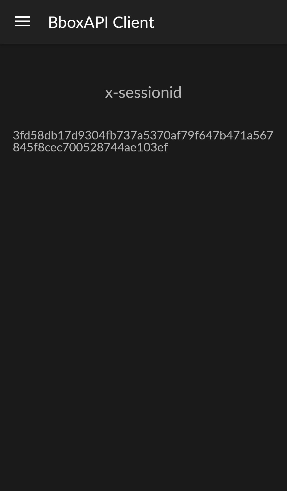

# bboxapi-client-android

BboxApi Client mobile application template

## Setup Android Studio

Do not forget to set your own credentials (appId and appSecret) provided by Bouygues Telecom in order to build your APK in this file :
https://github.com/BboxLab/bboxapi-client-android/blob/master/bboxapi/src/main/res/values/strings.xml

`BBOXAPI_APP_ID` and `BBOXAPI_APP_SECRET` are given by Bouygues Telecom. If you dont have these, here is following contact https://dev.bouyguestelecom.fr/dev/?page_id=51

## Setup at first launch

The first page on BboxApi client is this one : 

You have to enter the Bbox Miami ip address in order to make the application work correctly. Fortunately you can launch an automatic search but be careful because this mechanism works with only ONE Bbox Miami on the LAN.

Your appId and appSecret will be displayed on this menu :

If you want to see the x-sessionid created, you have to go to security menu :

## License

The MIT License (MIT) Copyright (c) 2016 BboxLab

